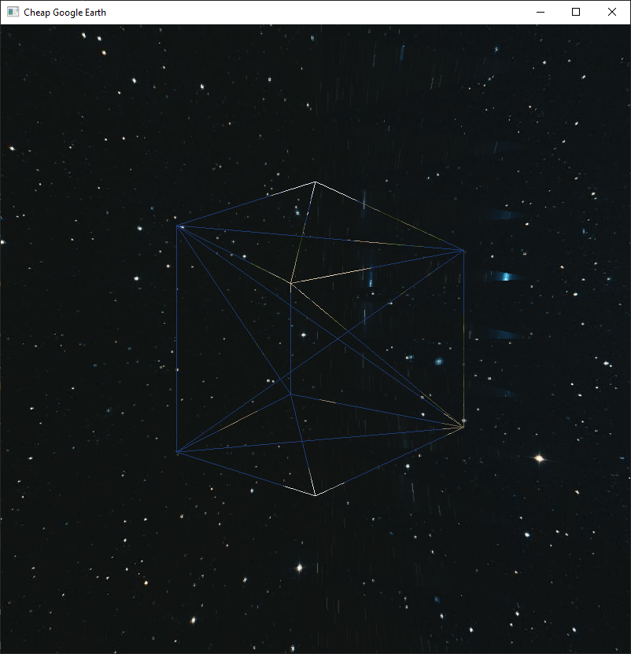

## Goals

- [x] Use an Element Buffer Object to optimize vertex drawing
- [x] Implement rotation of object using cursor movement -> Plus 1, 2, 3 keys!
- [x] Implement zoom using the middle mouse button
- [x] Minimum zoom level outside of the models inner facettes
- [x] Implement dynamic creation of sphere vertices with a Sphere class
- [x] Apply earth texture to sphere
- [x] Add a star sky wallpaper by implementing a generic draw function for Sphere
- [x] Fix Sphere glitch

### About the Sphere glitch

First, the glitch was caused by missing texcoords, which is why I had to change the generation from the vertices and indices up from creating a top and bottom connection with triangles only to rectangles, which made the process simpler.

If you enable the Wireframe mode, you will see that the next glitch is caused by two rectangles overlapping. Adjusting the algorithm again should fix this.

