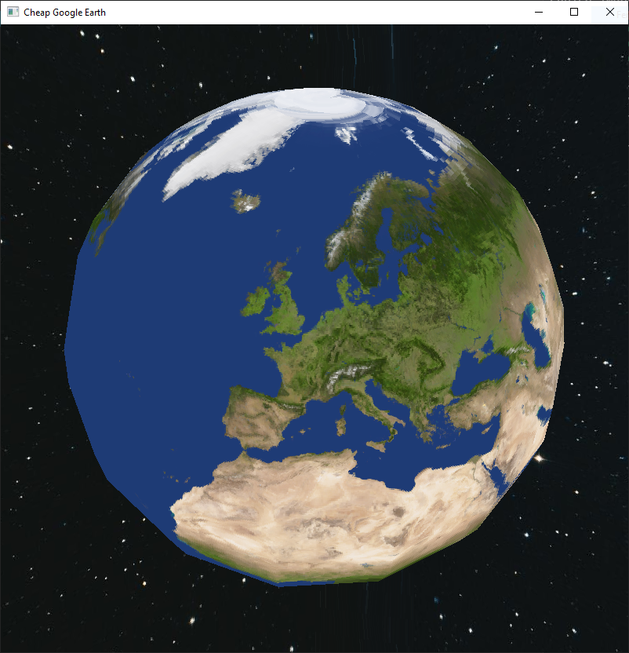

<h1>cheap-google-earth</h1>

## Small and simple program for rendering an earth model in OpenGL that can be viewed at from any angle

Control the rotation of the model using the 1 (X axis), 2 (Y axis) and 3 (Z axis) keys (non numpad).

## Screenshot

